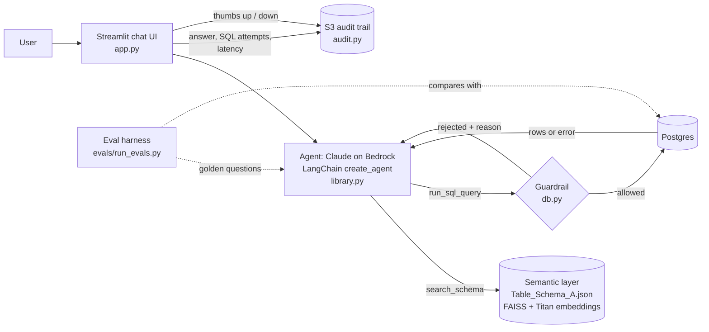

# Conversational analytics agent (natural language → SQL)

Ask questions about sales data in plain English. An LLM agent finds the relevant tables, writes SQL,
runs it against a real database, and answers with the result. When a question is ambiguous it asks
instead of guessing; when a query fails it reads the error and tries again.

The data is the public Northwind dataset (customers, orders, products…) in Postgres. The focus of the project is making an AI data product **trustworthy**: every
answer is checked by guardrails, recorded in an audit trail, open to user feedback, and measured
against a golden question set.

## Architecture



The agent is not a fixed pipeline: the model chooses, turn by turn, whether to search the schema, run
SQL, ask a clarifying question, or retry after a failure. Tool results (including guardrail
rejections) are fed back to the model, which is what lets it self-correct.

| File | Role |
|---|---|
| `app.py` | Streamlit UI, chat history, audit logging, feedback buttons |
| `library.py` | Bedrock LLM, schema search, the two agent tools, system prompt |
| `db.py` | The only code that touches the database; all guardrails live here |
| `audit.py` | Audit trail + feedback as immutable JSON events in S3 |
| `Table_Schema_A.json` | The semantic layer: tables, columns, descriptions, metric definitions |
| `evals/` | Golden set + harness + result history |
| `tests/` | Unit tests for guardrail, audit trail, eval grading |

## Accuracy and governance

| Concern | What is implemented | Where |
|---|---|---|
| Allowed data scope | Only tables/columns documented in the semantic layer can be queried; `SELECT *` on a table is refused. The same file feeds the model's schema search *and* the code that enforces scope, so what the model is told and what is allowed can't drift apart. | `db.py`, `library.get_allowed_scope` |
| Read-only | SQL is parsed (sqlglot, Postgres dialect), not pattern-matched: one statement only, no write/DDL node anywhere in the tree (including writable CTEs), no `SELECT … INTO`, no side-effect functions such as `pg_sleep`. A `READ ONLY` transaction is the backstop if the parser ever misses something. | `db.py` |
| Resource limits | Row cap, 5 s statement timeout, connections always closed. | `db.py` |
| Handling uncertainty | System prompt tells the agent to ask when a question names no measure/entity/period, to never invent numbers, and to say so when the data can't answer. | `library.AGENT_SYSTEM_PROMPT` |
| Scope and safety | The agent declines off-topic requests, write requests and prompt-extraction attempts. | system prompt + guardrail |
| Audit trail | One JSON event per answer: question, answer, every SQL attempt with status/error, row counts, latency, model, `reliability_signal`. Partitioned `audit/dt=YYYY-MM-DD/` for Athena/Spectrum. | `audit.py` |
| Feedback loop | 👍/👎 under each answer, stored as a separate event pointing at the answer's id (the answer record is never edited). | `app.py`, `audit.py` |
| Validation | Golden-set evals (below) and unit tests. | `evals/`, `tests/` |

### Evaluation

```bash
python -m evals.run_evals                    # all cases, writes evals/results/latest.md
python -m evals.run_evals --only seafood_revenue --workers 1
python -m unittest discover -s tests -t . -v # unit tests
```

The golden set (`evals/golden_set.json`) has five kinds of case:

- **answerable**: graded by *execution accuracy*. The agent's result set must equal the result of a
  hand-written gold query (column names/order ignored; extra columns tolerated; for "which is the top X"
  questions a ranking that leads with the gold row is accepted).
- **clarify**: vague questions where the right behaviour is to ask, not query.
- **out_of_scope**: off-topic or prompt-injection requests; no query, no leaked instructions.
- **restricted_data**: requests for columns outside the semantic layer (phone numbers, home addresses).
- **unsafe**: requests to delete/update/drop; the data must be unchanged after the run.

The gold questions are deliberately **not** the `sample_queries` in `Table_Schema_A.json`, because the
agent retrieves that file and testing on them would leak the answers.

History is kept in `evals/results/history/`:

| Run | Result | Note |
|---|---|---|
| baseline | 25/27 | `top_revenue_country` was judged correct by hand but failed a too-strict grader (fixed by adding `ranked_prefix` matching); `clarify_how_is_business` was a real failure: the agent built a report instead of asking |
| held-out vague questions, before prompt change | 1/2 | `clarify_product_summary` failed the same way, so the weakness was general, not one question |
| after prompt policy | 31/31, twice | clarify rule generalised to the held-out question; data unchanged after every run |
| final (after removing the Redshift-specific lint, parser switched to Postgres) | 31/31 | same behaviour, re-verified on the code that is pushed |

Read these as a sample, not a guarantee: the agent is non-deterministic, the set is small, and the grader
is lenient about extra columns. The point is a repeatable way to notice regressions when the prompt,
model or schema changes.

## Run it

```bash
python -m venv .venv && source .venv/bin/activate && pip install -r requirements.txt
cp .env.example .env            # DATABASE_URL (Postgres) and AWS credentials for Bedrock + S3
python scripts/load_northwind.py   # one-time: creates and fills the Northwind tables
streamlit run app.py
```

On Render, set `DATABASE_URL` to the **Internal** database URL; locally use the **External** one.

## Known limitations and next steps

- **Scope is checked by column name, not resolved through aliases.** A column allowed on one table
  referenced in the query is allowed for the query. Column-level enforcement in the database (views or
  grants) would be stricter.
- **`reliability_signal` is not a calibrated confidence score.** It records how the agent reached its
  answer (first attempt / after retry / failed / no query). Real confidence scoring would use something
  like self-consistency checks calibrated against the eval set.
- **No user identity or groups.** Everyone gets the same scope. Per-group scope would be a different
  scope map per user group.
- **No monitoring yet.** Audit events are ready to query, but there is no dashboard or alerting on
  accuracy, failure rate or negative feedback.
- **S3 is a log destination, not a data source.** The older `logs.xlsx` conversation log is still
  written alongside the new audit events and should be retired.
- The schema dropdown lists `Schema_Type_B` and `Schema_Type_C`, which have no schema files yet.
